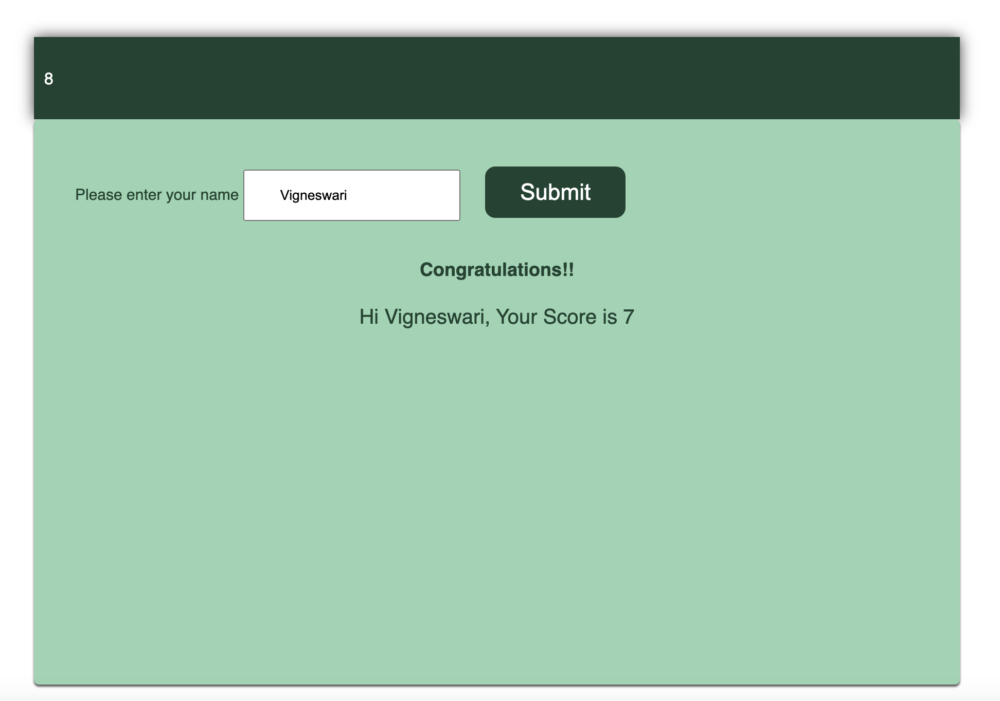

# JS-Quizlathon

## Description

This webpage was created to demonstrate the knowledge gained in the Advanced Javascript week in coding boot camp and as a part of the class assignment submission. The Quizlathon page was developed using HTML, CSS, and JS technology. The online quiz application starts when the user clicks on the start button. Once started, the user will have 30 seconds to complete the challenge. New questions will be auto-populated as soon as the user answers the question, and the application will show whether the selected option is correct. If the user selects a wrong answer, the timer will be reduced by 5 seconds. On test completion, the user will be prompted for a name, and the score will be populated on submission.

## Installation

N/A

## Usage

To use this webpage, click the HTML page, which will open in the browser. The view the code, open the webpage in an HTML editor. When opened in a browser, the HTML page is viewed as below.

The application source code can be accessed here https://github.com/Vigneshwarie/JS-Quizlathon

## Credits

The questions are referred from this website https://www.interviewbit.com/javascript-mcq/
